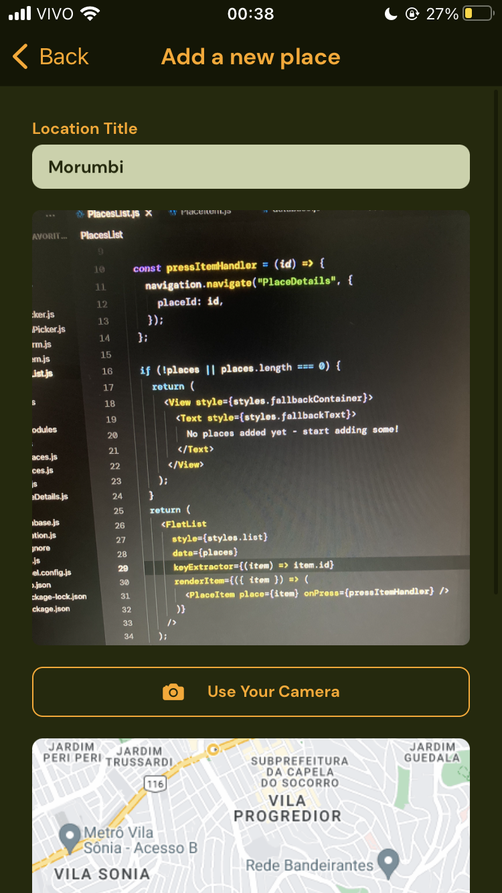
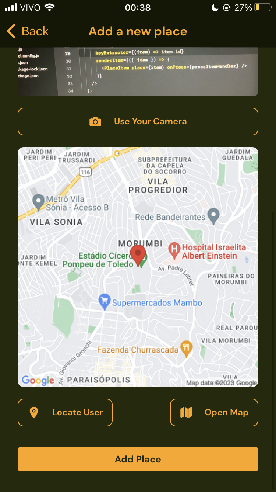
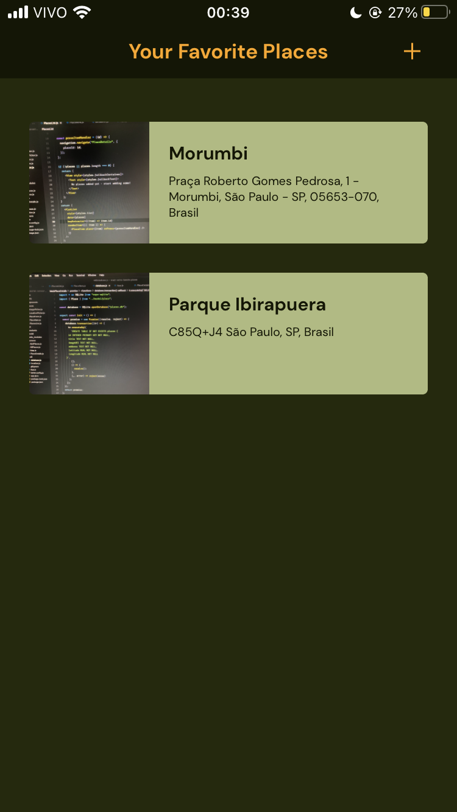

# Favorite Places

 &nbsp;&nbsp;

 &nbsp;&nbsp;

> Aplicativo feito em React Native para listar seus lugares favoritos com foto e localização.

### Ajustes e melhorias

Projeto concluído! Abaixo as funcionalidades:

- [x] Implementação básica dos componentes
- [x] Utilização de elementos genéricos e reutilizáveis
- [x] Desenvolvimento de navegação utilizando React Native Stack Navigator
- [x] Utilização SQLite para lidar com dados e armazená-los no dispositivo
- [x] Implantação do uso do Image Picker e Location Picker com autorização do usuário
- [x] Utilização de mapas interativos

## 💻 Pré-requisitos

Antes de começar, verifique se você atendeu aos seguintes requisitos:

- Você instalou a versão mais recente de `Node.js`, `git` e tem, ao menos, um simulador de `Android` ou `iOS`

## 🚀 Instalando Favorite Places

Para instalar o Favorite Places, siga estas etapas:

- Clone esse repositório com `git clone https://github.com/gguilhermelopes/react-native-favorite-places`
- `cd react-native-favorite-places`
- Instale as dependências com `npm install`

## ☕ Usando Favorite Places

Para usar Favorite Places, siga estas etapas:

- Certifique-se de que tem ao menos um simulador de `Android` ou `iOS` aberto
- Se não possuir, utilize o app `Expo Go` no seu celular `Android` ou `iOS` e esteja na mesma rede Wi-Fi de sua máquina
- Insira `npm start` na pasta do projeto.
- Se utilizar um simulador, insira `a` para abrir o projeto no `Android` e/ou `i` para abrir no `iOS`
- Se utilizar o celular, scaneie o QR code indicado na linha de comando para que o app seja carregado
